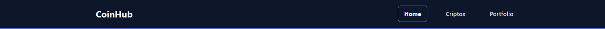
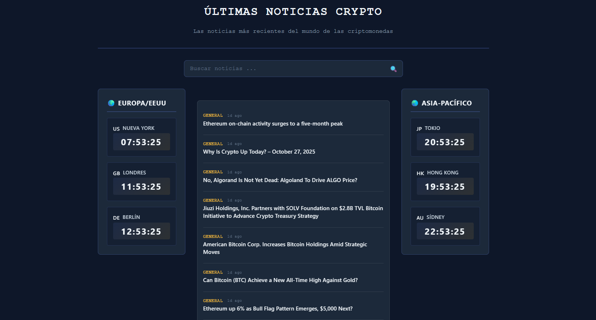
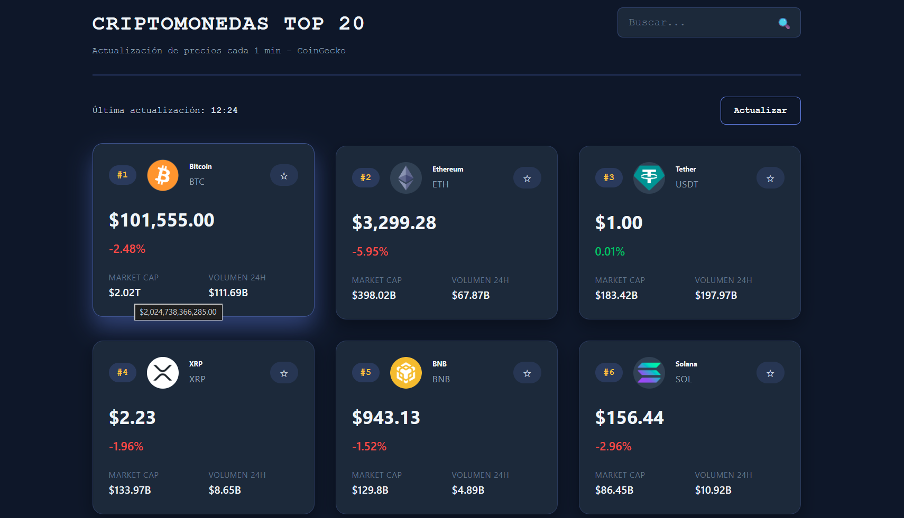
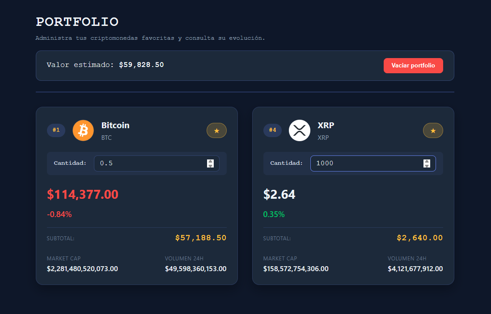

# CriptoNews

Dashboard de criptomonedas con precios en tiempo real, noticias y portfolio personalizado.

## Capturas de pantalla

_Header con navegación principal (Home, Criptos, Portfolio). Implementado con React Router v6 usando componente Layout y Outlet para rutas anidadas._

_Página Home: lista de noticias desde CryptoPanic API con SearchForm (filtrado en tiempo real). WorldClocks con 6 zonas horarias calculadas con Date y toLocaleTimeString. Actualización cada segundo con useEffect._

_Top 20 criptomonedas desde CoinGecko API. Precios actualizados cada 60 segundos con polling. Animaciones verde/rojo detectando cambios con useRef. Implementado con custom hook useCriptos y componente CoinCard con React.memo._

_Portfolio personalizado con Context API. Permite añadir cantidades decimales (input con step="0.00000001"). Calcula valor total multiplicando precio × cantidad. Persistencia en localStorage. Usa PortfolioProvider y hook usePortfolio._

## Tecnologías

React 19, Vite 7, React Router v6, CSS Modules, ESLint

APIs: CoinGecko, CryptoPanic

## Detalles de implementación

- Polling automático cada 60 segundos para precios
- Caché en sessionStorage (10min coins, 30min noticias)
- Portfolio persistente en localStorage
- Detección de cambios de precio con animaciones
- Optimizaciones con React.memo, useMemo, useCallback

## Requisitos del proyecto

**1. Web full responsive:** CSS Grid/Flexbox con media queries

**2. Arquitectura:** Estructurado por componentes. Cada componente y página en su propia carpeta con su CSS Module

**3. Mínimo 3 páginas + Router:** Home, Criptos, Portfolio, DetalleNoticia con React Router v6

**4. Mínimo 3 estados:** portfolio, coins, noticias, loading, error, query, priceTrend, localQuantity, isAnimating, currentTime

**5. useEffect para peticiones:** useCriptos (fetch + polling), useNoticias (fetch), CoinCard (precio), WorldClocks (timer)

**6. Uso de API:** CoinGecko (precios), CryptoPanic (noticias)

**7. Formulario:** SearchForm con useState + useRef

**8. Componentes reutilizables:** CoinCard, NoticiaCard, SearchForm, WorldClocks, Header, Footer, Layout

**9. Sin re-renders innecesarios:** React.memo, useMemo, useCallback

**10. Custom hook:** useCriptos, useNoticias, usePortfolio

**11. useContext:** PortfolioContext + PortfolioProvider con localStorage
